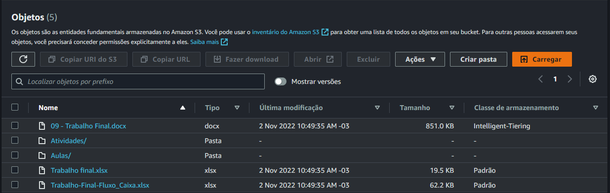

#  Estudos de AWS S3


---

## 2. CLI

Operação realizadas no S3 utilizando o Command Line Interface:

**Requisitos:**

1. Ter instalado o [AWS CLI](https://docs.aws.amazon.com/cli/latest/userguide/getting-started-install.html);
2. Ter configurado o arquivo `c:/Users/<seu usuário>/.aws/credentials com a Access e Secret Key de um usuário do IAM com acesso programático e permissões de leitura e escreita no S3.

#### 2.1) Download de multiplos objetos

> Via console, só é possível realizar operações individuais sobre os objetos do Bucket, um a um, o que pode ser um problema quando se quer operar sobre vários objetos de uma vez.

**Sintaxe do código:**

```bash
aws s3 cp <target> <destino> --recursive
```
> **Note**
> This is a note

> **Warning**
> This is a warning

**Exemplo de download para a máquina local:**

No bucket `s3://gus-bucket-pessoal/estudos/Graduacao-UFABC/UFABC-EngenhariaEconomica/` há um conjunto de arquivos e pastas com arquivos que farei o download para o caminho `c:/Users/gusta/Downloads/s3/`.



Código CLI
```bash
aws s3 cp s3://gus-bucket-pessoal/estudos/Graduacao-UFABC/UFABC-EletronicaDigital/ C:\USers\gusta\Downloads\s3\ --recursive
```

---