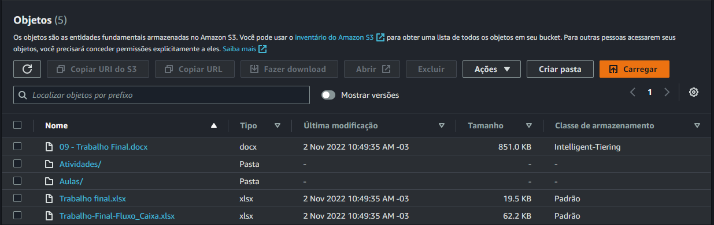
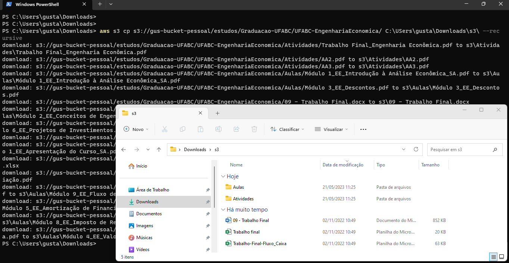
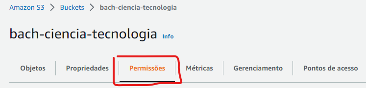
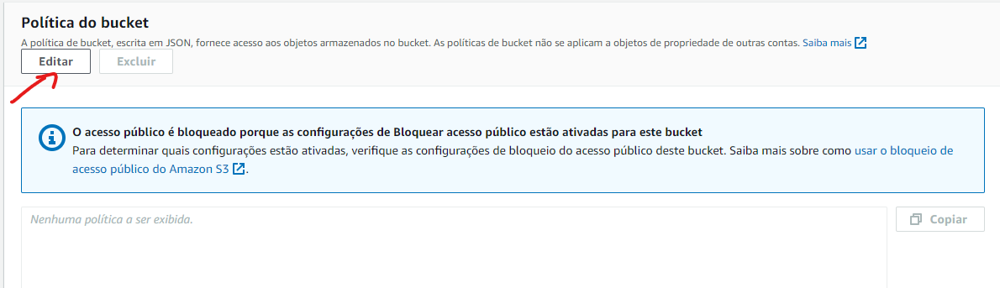
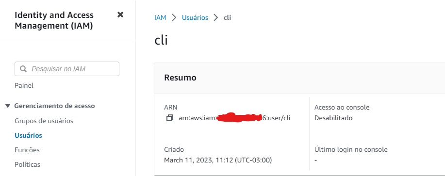
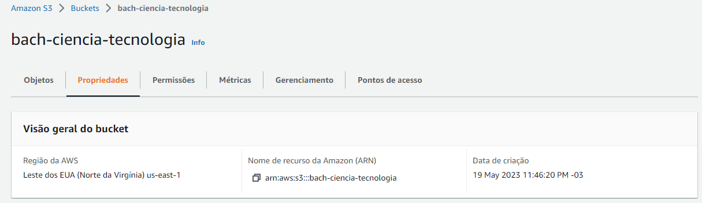
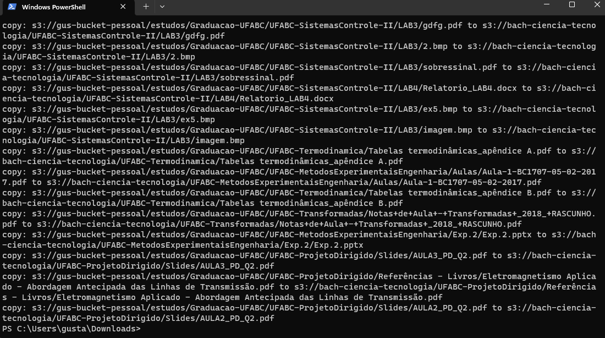

#  Estudos de AWS S3 - CLI


## 1. CLI

Operações realizadas no S3 utilizando o Command Line Interface:

**Requisitos:**

1. Ter instalado o [AWS CLI](https://docs.aws.amazon.com/cli/latest/userguide/getting-started-install.html);
2. Ter configurado o arquivo `c:/Users/<seu usuário>/.aws/credentials` com a Access e Secret Key de um usuário do IAM com acesso programático e permissões de leitura e escreita no S3.

- [1.1. Download de múltiplos objetos](#11-download-de-multiplos-objetos)
- [1.2. Cópa de objetos entre buckets de contas diferentes](#12-cópia-de-objetos-entre-buckets-de-contas-diferentes)
- [1.3. Deleção de pasta no bucket](#13-deleção-de-pasta-no-bucket)
- [1.4. Cópia de objetos do Glacier](#14-cópia-de-objetos-do-glacier)
- [1.5. Multipart Upload](#15-multipart-upload)

---

### 1.1) Download de multiplos objetos

> Via console, só é possível realizar operações individuais sobre os objetos do Bucket, um a um, o que pode ser um problema quando se quer operar sobre vários objetos de uma vez.

**Sintaxe do código:**

```BASH
aws s3 cp <target> <destino> --recursive
```
> **Note**
> A clausula `--recursive` serve para iterar sobre todos os objetos do bucket/ pasta de origem.


**Exemplo de download para a máquina local:**

No bucket `s3://gus-bucket-pessoal/estudos/Graduacao-UFABC/UFABC-EngenhariaEconomica/` há um conjunto de arquivos e pastas com arquivos que farei o download para o caminho `c:/Users/gusta/Downloads/s3/`.



Código CLI
```BASH
aws s3 cp s3://gus-bucket-pessoal/estudos/Graduacao-UFABC/UFABC-EngenhariaEconomica/ C:\Users\gusta\Downloads\s3\ --recursive
```


---

### 1.2) Cópia de objetos entre buckets de contas diferentes

> **Warning**
> só funciona para arquivos cuja classe de armazenamento não seja Glacier.

> Nesse cenário, temos 20 pastas com vários objetos na `conta-A` e iremos fazer a cópia desses objetos para um bucket que existe na `conta-B`.

Primeiro, é preciso configurar uma **Política de Bucket** no Bucket da `conta-B` para que o usuário programático da `conta-A` tenha permissão de executar a ação de `PUT OBJECT` no bucket da conta destino.

Entre no Bucket da `conta-B` e vá em **Permissões**;



Vá em **Política do Bucket** e clique em **Editar**;



Configure sua police com base no template:

```JSON
{
"Version": "2012-10-17",
"Id": "PutObjPolicy",
"Statement": [{
  "Sid": "AllowPutObjectCrossAcount",
  "Principal": {
      "AWS" : [
        "<arn do usuário 1 que receberá o acesso>",
        "<arn do usuário 2 que receberá o acesso>"
        ]
    },
  "Effect": "Allow",
  "Action": "s3:PutObject",
  "Resource": "<arn do bucket destino>"
    }]
}
```

> Documentação de referência: [Bucket policy examples](https://docs.aws.amazon.com/AmazonS3/latest/userguide/example-bucket-policies.html)

> **Note**
> você consegue obter o ARN do usuário na console do IAM. O mesmo vale para o Bucket ao acessar as **Propriedades do Bucket** na console.
>
> 
> 

Clique em `Salvar alterações`;

Em seguida, certifique-se de ter configurado o arquivo `C:/Users/<seu usuário>/.aws/credentials` com o acesso do usuário programático da `conta-A`;

Execute o comando a seguir para copiar todos os objetos do bucket da `conta-A` para o bucket da `conta-B`:

```BASH
aws s3 cp s3://<nome_do_bucket_origem>/ s3://<nome_do_bucket_destino>/ --recursive
```

Aguarde até que a cópia finalize.



---

### 1.3) Deleção de pasta no Bucket

Para deletar diversos objetos em uma pasta no bucket simultaneamente, execute o comando:

```BASH
aws s3 rm s3://<nome_do_objeto>/ --recursive
```

---

### 1.4) Cópia de objetos do Glacier

Para operar sobre objetos do Glacier, é preciso primeiro restaurá-los, mas caso queira forçar a operação, basta usar o parâmetro `--force-glacier-transfer`.

```bash
aws s3 cp s3://<bucket_origem>/ s3://<bucket_destino> --force-glacier-transfer
```

> **Obs.**: como não estou passando o parâmetro `--storage-class`, a classe de armazenamento dos objetos no bucket de destino será `STANDARD`.

> **Warning**
> - Não esqueça que o usuário programático da conta de origem precisa ter permissão de `GET_OBJECT` na bucket policy do bucket de destino.

---

### 1.5) Multipart Upload

Comandos `aws s3`, como o `aws S3 cp`, aplicam multipart upload automaticamente tantao para upload quanto download de arquivos grandes. O caso a seguir, seria específico para o caso em que os comandos `aws s3` não suportem um upload específico. Para esses casos, precisamos usar `aws s3api`, como `aws s3api create-multipart-upload`.
