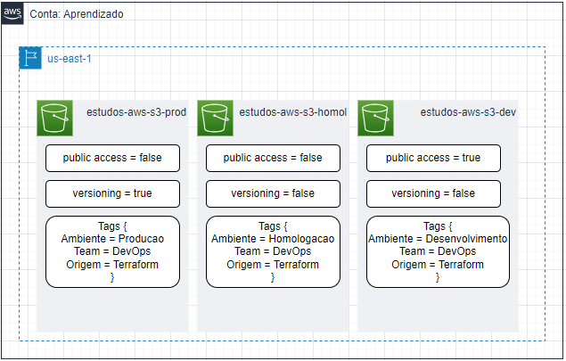
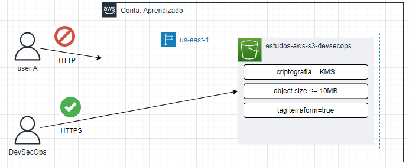

#  Estudos de AWS S3 - Infra as Code

Casos de estudo:

[caso-01](./caso-01/): criação de 3 buckets na mesma região separados por ambiente.

---

[caso-02](../caso-02/): criação de um bucket que atende as seguintes condições de segurança:

* Aceita apenas upload de objetos criptografados pelo KMS;
* Aceita apenas requisições HTTPS (não aceita HTTP);
* Permite apenas `PUT` de objetos feitos pelo usuário `DevSecOps`;
* Bloqueia upload de objetos que não tenham a tag `terraform=true`;
* Bloqueia upload de objetos maiores que 10MB.

