#  Estudos de AWS S3 - Teoria

> **Simple Storage Service (S3)**: sistema de armazenamento de objetos

- [1. Conceitos iniciais](#1-conceitos-iniciais)
- [2. Classes de Armazenamento](#2-classes-de-armazenamento)
- [3. Gerenciamento de Armazenamento](#3-gerenciamento-de-armazenamento)

    - [3.1. Política de Ciclo de Vida](#31-política-de-ciclo-de-vida)
    - [3.2. Bloqueio de Objetos](#32-bloqueio-de-objetos)
    - [3.3. Cross-Replication](#33-replicação)
    - [3.4. S3 Batch Operations](#34-s3-batch-operations)
    - [3.5. Versionamento](#35-versionamento)
- [4. Gerenciamento de acesso e segurança](#4-gerenciamento-de-acesso-e-segurança)
    - [4.1. Bloqueio de acesso público](#41-bloqueio-de-acesso-público)
    - [4.2. IAM](#42-iam) <<< doing
    - [4.3. Bucket Policy](#43-bucket-policy)
    - [4.4. Endpoints/ Access Points](#44-endpoints-access-points)
    - [4.5. ACLs](#45-acls) <<< to do
    - [4.6. Propriedade de objeto do S3](#46-propriedade-de-objeto-do-s3) <<< to do
    - [4.7. IAM access analyzer para S3](#47-iam-access-analyzer-para-s3) <<< to do
- [5. Outros recursos](#5-outros-recursos)
    - [5.1. S3 Storage Lens](#51-s3-storage-lens)
    - [5.2. Análise de classes de armazenamento](#52-análise-de-classes-de-armazenamento)
    - [5.3. S3 Transfer Acceleration](#53-s3-transfer-acceleration)
    - [5.4. Logs de acesso](#54-logs-de-acesso)
    - [5.5. S3 Select](#55-s3-select)
    - [5.6. Hospedagem de sites estáticos](#56-hospedagem-de-sites-estáticos)
    - [5.7. Multpart Upload](#57-multpart-upload)
    - [5.8. Cross Resource Sharing](#58-cross-resource-sharing)
    - [5.9. Amazon S3 Analytics](#59-amazon-s3-analytics)
    - [5.10. Event Notification](#510-notificação-de-eventos)
    - [5.11. S3 Byte-Range Fetches](#511-s3-byte-range-fetches)
    - [5.12. S3 Object Lambda](#512-s3-object-lambda) <<< to do
- [6. Modelo de consistência de dados](#6-modelo-de-consistência-de-dados)

---

## 1. Conceitos iniciais

O S3 pode ser usado para armazenar qualquer volume de dados estruturados, semi-estruturados e não estruturados. O serviço garante alta durabilidade e disponibilidade dos objetos armazenados porque os dados são armazenados em pelo menos 3 zonas de disponibilidade de forma automática.

**Durabilidade**:

* Alta durabilidade de objetos entre multiplas AZs (99.999999999%, 11 9's). Se você armazenar 10.000.000 de objetos no S3, você em média ira perder um objeto a cada 10.000 anos;
* A durabilidade é a mesma para todas as classes de armazenamento.

**Disponibilidade**:

* Mede o quão disponível para leitura o serviço é;
* Depende da classe de armazenamento. Exemplo: S3 standart tem 99.99% de disponibilidade = não disponível em 53 minutos no ano.

**Performance**:

Amazon S3 escala automaticamente para ranges de alta requisição, com latência de 100-200 ms.

Sua aplicação pode alcançar:

* 3.500 requisições de put/copy/post/delete por segundo por prefixo em um bucket, ou;
* 5.500 requisições de get/head por segundo por prefixo em um bucket.

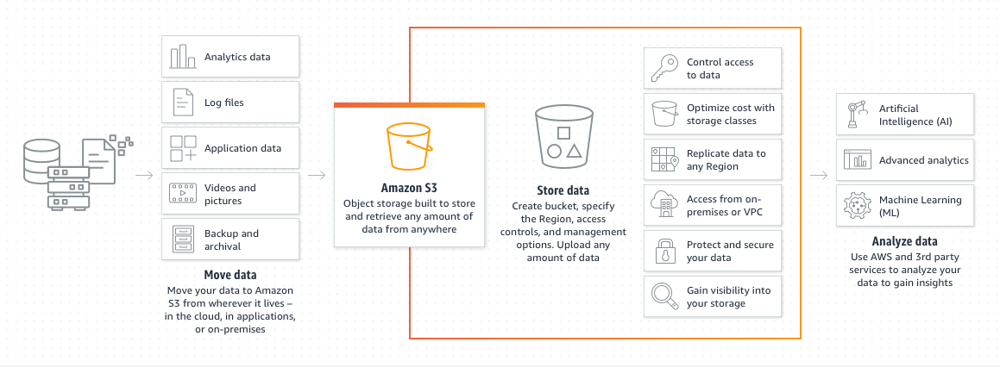

- **Buckets**: os dados são armazenados em Buckets que são estruturas com nome único em toda a internet (2 buckets não podem ter o mesmo nome em todo o planeta). Não há limites para a quantidade de dados que você pode armazenar no Bucket;

- **Objetos**: são os arquivos, dados ou qualquer item a ser armazenado nos buckets. Cada objeto possui as seguintes caracterísitcas:
    
    - Possui um **Key** que é o nome do objeto dentro do bucket;
    - No S3 não existe o conceito de pasta (embora os recursos de UI da plataforma emulem isso), nesses casos, a **key** do objeto é composta por um **prefixo**, que seriam os nomes dos diretórios + **object name**;
    - Pode ter um **version ID** que representa a versão do objeto no bucket. A junção da Key com o Version ID identificam cada objeto no bucket como único;
    - **Value**, que é o conteúdo do objeto. Cada objeto individualmente pode ter até 5 TB;
    - **Metadata**, lista de `key/ value pairs` gerados por sistema ou usuário para inserir alguns metadados no objeto;
    - **Prefixo**: tudo que há entre o nome do bucket e do objeto. Por exemplo, em `s3://my-bucket/my_folder1/another_folder1/my_file.txt`, o prefixo é `my_folder1/another_folder1/`.

**Casos de uso**

* Backup and storage;
* Disaster Recovery;
* Archive;
* Hybrid Cloud Storage;
* Application Hosting;
* Media Hosting;
* Data Lakes & Big Data Analytics;
* Software Delivery;
* Statis Website.

**Regras para nomenclatura do Bucket**

* Proibido usar uppercase e underscore;
* 3-63 caracteres (sem acentos);
* Não pode ser um ip;
* Precisa começar com letra minúscula ou número;
* Não pode começar com o prefixo `xn--`;
* Não pode terminar com o sufixo `-s3alias`.

[](https://docs.aws.amazon.com/AmazonS3/latest/userguide/UsingObjects.html)

---

## 2. Classes de Armazenamento

**S3 Standart**: Classe padrão. Se você não especificar a classe ao fazer upload de um objeto, o S3 assumirá a classe S3 Standart. Destinada para dados acessados com frequência. Você paga por GB armazenado e pelo n° de chamadas as APIs do S3 (PUT, GET, COPY, ...). Não há taxas de recuperação para S3-Standart;

> **Use cases**: Big Data Analytics, Mobile & Gaming Applications, Distribuição de Conteúdo.

**S3 Intelligent-Tiering**: Automação que movimenta os arquivos automaticamente para a classe mais apropriada. Você é cobrado pelo armazenamento, chamadas à API e pela quantidade de objetos monitorados pelo Inteligent-Tiering. Ideal quando o padrão de acesso dos objetos é desconhecido ou variável. Não há taxas de recuperação para S3 Intelligent-Tiering. Para acessar arquivos que o Intelligent-Tiering moveu para arquivamento, é preciso primeiro restaurá-los. Ao tentar acessar um objeto movido para uma classe de acesso infrequente, o Intelligent-Tiering o move primeiro para uma classe de acesso frequente para não serem cobradas taxas de recuperação.
Se o tamanho de um objeto for menor que 128 KB, ele não será monitorado nem qualificado para o nivelamento automático. Objetos menores que isso são sempre armazenados no nível de acesso frequente;

* Frequent Access Tier (automatico): default tier;
* Infrequent Access Tier (automatico): objetos não acessos por 30 dias;
* Archive Instant Access Tier (automatico): objetos não acessados por 90 dias;
* Archive Access Tier (opcional): configurável de 90 a 700+ dias;
* Deep Archive Access Tier (opcional): configurável de 180 a 700+ dias.

**S3 Standart – IA**: Para dados duradouros e acessados com pouca frequência. A latência do primeiro bit é de milissegundos também, mas é cobrada uma taxa por recuperação. Se um objeto tiver menos de 128 KB e for armazenado nessa classe, ele será cobrado como um objeto de 128 KB. Além disso, o tempo mínimo cobrado pelo objeto é de 30 dias. Se ele ficar salvo por 1 dia e for deletado, você é cobrado por um armazenamento de 30 dias;

> **Use Cases**: Disaster Recovery, Backups.

**S3 One Zone – IA**: Para dados duradouros e acessados com pouca frequência que podem ser gerados novamente ou que não são críticos e que não precisam de alta resiliência e disponibilidade. Ao contrário das outras classes que utilizam um modelo de replicação do dado em pelo menos 3 AZs, essa classe usa somente uma AZ;

> **Use Cases**: Backup Secundário ou dados que você pode recriar.

**S3 Glacier Instant Retrieval**: Para arquivar dados que raramente são acessados e exigem recuperação de milissegundos. A taxa de recuperação do dado é mais alta. Duração mínima de storage de 90 dias;

**S3 Glacier Flexible Retrieval**: Possui um período mínimo de armazenamento de 90 dias e a latência do primeiro bit é de:

* Expedited: 1 a 5 mintos;
* Standar: 3 a 5 horas;
* Bulk: 5 a 12 horas.

**S3 Glacier Deep Archive**: Classe mais barata, para dados raramente acessados. Os dados têm um período mínimo de duração de armazenamento de 180 dias e um tempo de recuperação padrão de:

* Standart: 12 horas;
* Bulk: 48 horas.


**Comparação das classes de armazenamento**:
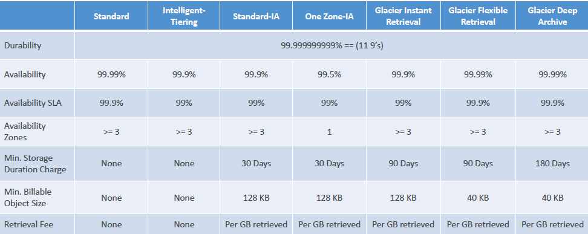

**Movimentações possíveis entre classes de armazenamento**:
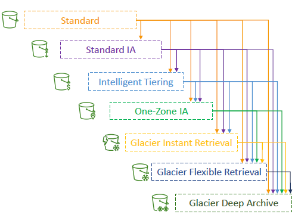

[](https://docs.aws.amazon.com/AmazonS3/latest/userguide/storage-class-intro.html)

---

## 3. Gerenciamento de Armazenamento

### 3.1. Política de Ciclo de Vida

> Te permite configurar políticas de ciclo de vida dos objetos em um Bucket. Com a regra de ciclo de vida, você consegue definir:

- **Escopo**: dizer se a regra será aplicada a todos os objetos do bucket ou a objetos que atendam a uma regra específica (com uma tag, prefixo no nome, que tenham um tamanho mínimo ou máximo);
- **Ação da versão atual**: refere-se a ação de mover a versão mais recente do objeto entre classes de armazenamento a partir da quantidade de dias de vida do objeto;
- **Ações de versões desatualizadas**: basicamente, você pode fazer a mesma ação de movimentação entre classes e ainda escolher se quer apagar um número específica de versões desatualizadas do objeto;
- **Marcadores de exclusão de objeto expirado**: definir um prazo de validade em dias de vida para o objeto para, ao atingir a validade, ser deletado;
- **Carregamentos Multipart incompletos**: quando um objeto é carregado no S3 usando a API de `multipart upload`, é possível excluir as partes corrompidas de cargas incompletas usando esse recurso.

**Exemplo de uma lifecyle policy**
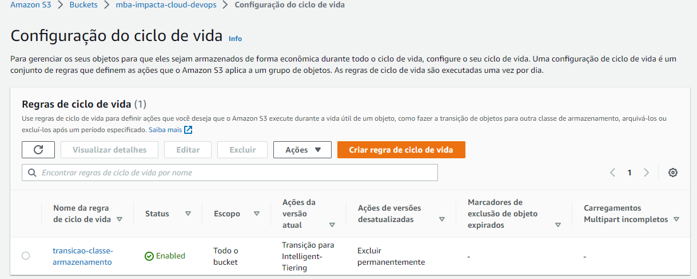

[](https://docs.aws.amazon.com/AmazonS3/latest/userguide/object-lifecycle-mgmt.html)

### 3.2. Bloqueio de objetos

Você pode habilitar esse recurso ao criar um bucket para prevenir deleções acidentais ou que o objeto seja sobrescrito.

> **Warning**
> - Você só consegue habilitar esse recurso na criação do bucket (não é possível habilitar depois);
> - Para poder habilitar esse recurso, o versionamento do bucket precisa estar habilitado.

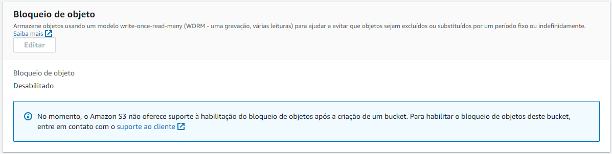

Você também pode exigir uma confirmação com MFA para executar a deleção ou atualização de um objeto protegido.

[](https://docs.aws.amazon.com/AmazonS3/latest/userguide/object-lock.html)

### 3.3. Replicação

É possível configurar o bucket para fazer replicação de dados assíncrona em um outro bucket, de modo que ao inserir objetos no bucket source, o dado é automaticamente replicado no bucket target.

É necessário que haja permissão de leitura (IAM ou Bucket Policy) no bucket de origem e permissão de escrita no bucket target.

> **Note**
> - Os buckets podem estar em Regions diferentes.

* CRR: Cross-Region Replication;
* SRR: Same-Region Replication.

> **Warning**
> - Você consegue habilitar a replicação em um bucket existente, porém, os dados inseridos antes da habilitação da replicação não são copiados para o bucket replicado. Se quiser que os dados existentes antes da habilitação da replicação sejam replicados, é preciso usar **S3 Batch Replication** (que também pode ser usado caso alguma replicação de objeto falhe).

Adicionalmente, é possível replicar **delete markers** do bucket source para o target, pois por default, deleções de um version ID não são replicados para evitar deleções maliciosas.

Não existe "chaining replication". Se o Bucket A replica para o Bucket B, e o Bucket B para o C, então o Bucket A **não replica automaticamente** para o bucket C.

[](https://docs.aws.amazon.com/AmazonS3/latest/userguide/replication.html)

### 3.4. S3 Batch Operations

Recurso que permite realizar diversas operações em larga escala nos objetos do S3. Você pode utilizar para:

- Copiar objetos
- Restaurar diversos objetos do Glacier

**Terminologia**

- **Job**: unidade de trabalho do S3 Batch Operations. Contém todas as informações necessários para realizar as operações em objetos listados em um arquivo de manifesto (json);
- **Operation**: é o tipo de API action que você quer executar na operação batch. Cada job opera um único tipo de operação através dos objetos especificados no manifesto (GET, COPY);
- **Task**: unidade de execução de um job. Representa uma única chamada de uma operation em um objeto. O S3 Batch Operations cria uma task para cada objeto especificado no manifesto.

**Exemplo 1**: Usar o S3 Batch Operations para restaurar diversos objetos do Glacier Deep Archive.

> **Cenário**: possuo um bucket chamado `gus-bucket-pessoal` na região `us-east-2` que possui uma pasta chamada `livros`. Essa pasta possui subpastas de categorias de livros como `computação`, `matematica` e `fisica` e dentro de cada uma delas há diversos PDFs armazenados no Glacier Deep Archive.

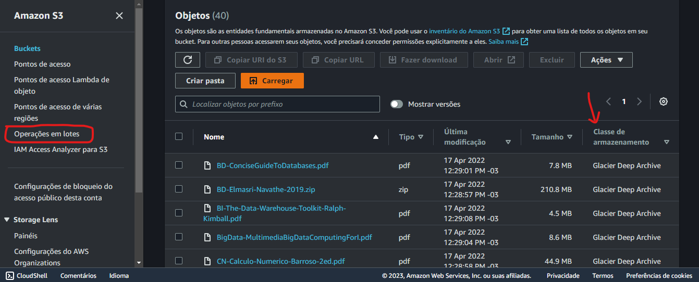

Acessar o menu "Operações em lote" como destacado na imagem anterior. Alterar a região do job para a mesma região do bucket (no meu caso, us-east-2) e criar o job.

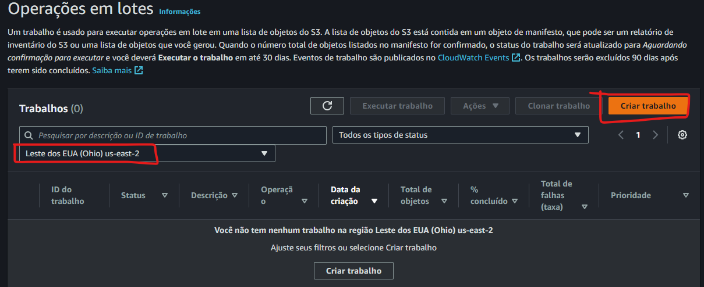

Para informar ao job quais objetos sofrerão a operação em lote, é preciso informar um arquivo de manifesto.

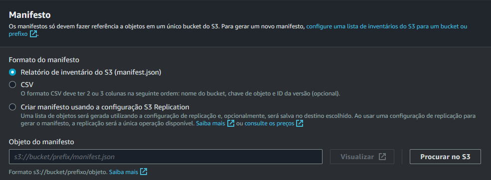

O manifesto pode ser:

- Um arquivo `manifest.json` gerado pelo [Relatório de Inventário do S3](https://docs.aws.amazon.com/pt_br/AmazonS3/latest/userguide/storage-inventory.html?icmpid=docs_amazons3_console);

- Pode ser um arquivo csv configurado por você, como no exemplo a seguir:

Sem Version ID
```json
Examplebucket,objectkey1
Examplebucket,objectkey2
Examplebucket,objectkey3
Examplebucket,photos/jpgs/objectkey4
Examplebucket,photos/jpgs/newjersey/objectkey5
Examplebucket,object%20key%20with%20spaces
```

Com Version ID (opcional)
```json
Examplebucket,objectkey1,PZ9ibn9D5lP6p298B7S9_ceqx1n5EJ0p
Examplebucket,objectkey2,YY_ouuAJByNW1LRBfFMfxMge7XQWxMBF
Examplebucket,objectkey3,jbo9_jhdPEyB4RrmOxWS0kU0EoNrU_oI
Examplebucket,photos/jpgs/objectkey4,6EqlikJJxLTsHsnbZbSRffn24_eh5Ny4
Examplebucket,photos/jpgs/newjersey/objectkey5,imHf3FAiRsvBW_EHB8GOu.NHunHO1gVs
Examplebucket,object%20key%20with%20spaces,9HkPvDaZY5MVbMhn6TMn1YTb5ArQAo3w
```

Apenas o `Bucket` e o `Object ID` são obrigatórios.

Como no meu caso tenho mais de 300 objetos no Glacier Deep Archive, vou usar o Relatório de Inventário do S3 para gerar um csv com todos esses objetos pra mim.

O Amazon S3 Inventory fornece arquivos de saída nos formatos CSV (valores separados por vírgulas), ORC (colunar de linhas otimizado do Apache) ou Apache Parquet que listam seus objetos e os metadados correspondentes, diária ou semanalmente, para um bucket do S3 ou prefixo compartilhado (ou seja, objetos que tenham nomes que comecem com uma string comum).

Acessar as configurações de gerenciamento do bucket.

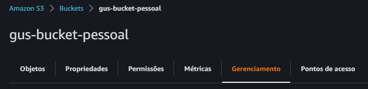

Criar uma configuração de inventário.

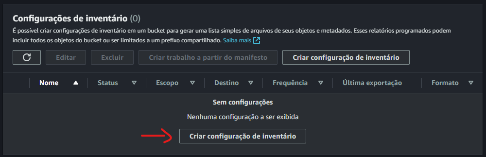

Informe um nome e o prefixo do escopo do relatório de inventário, que serão os objetos que estarão listados no relatório. No meu caso, todos os objetos estão na pasta `livros`.

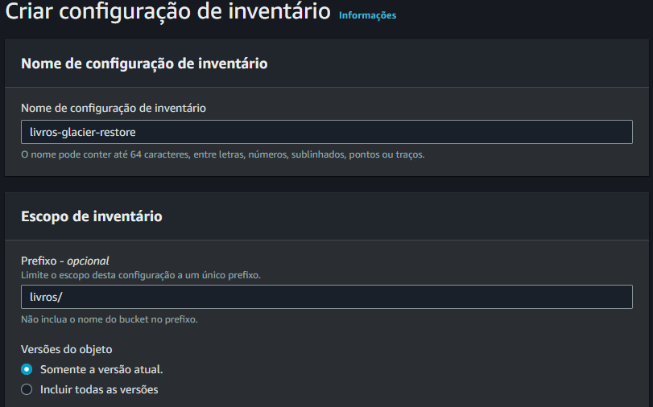

Configure um bucket target onde o manifest.json será salvo. O bucket target precisa estar na mesma região do bucket origem.

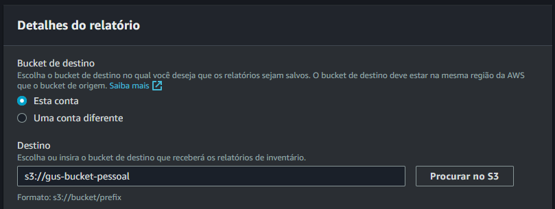

Escolha a frequência e formato do relatório.

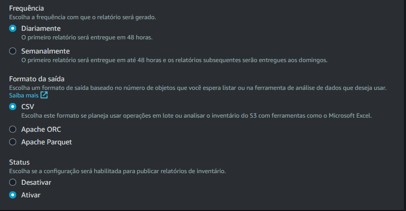

> **Note**
> - O primeiro relatório só é gerado após 48h.

Caso queira, você pode adicionar informações ao relatório.

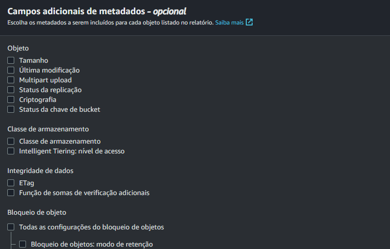

Aguardar cerca de 48h até que seu relatório de inventário esteja disponível no bucket de destino.

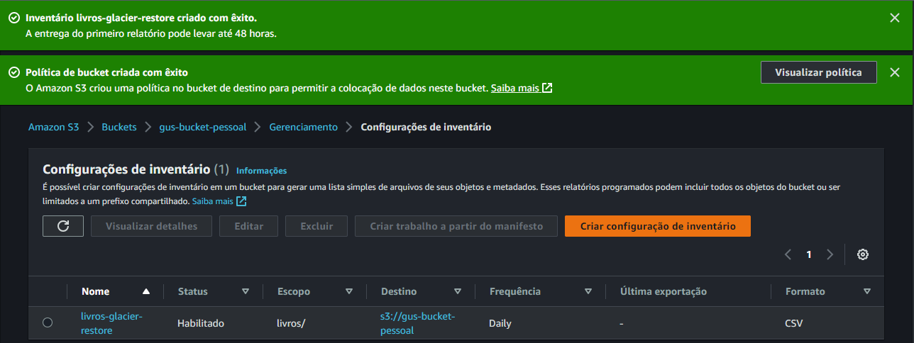

Assim que o relatório estiver disponível, selecioner o relatório e clicar em `Criar trabalho a partir do manifesto`

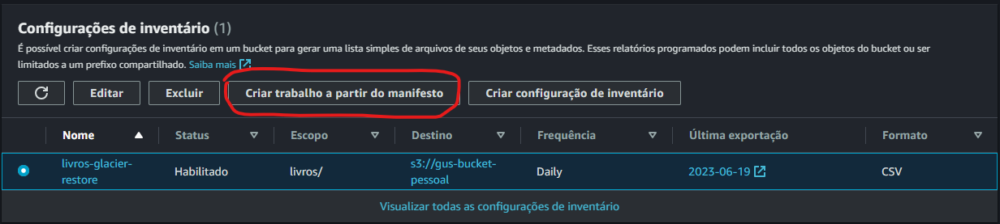

As informações do job batch serão preenchidas automaticamente com base no manifesto do relatório.

Selecionar a opração em lote que deseja realizar, no meu caso, será restauração de objetos do Glacier Deep Archive.

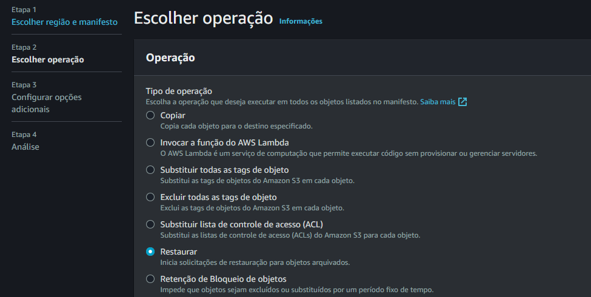

Escolher as configurações específicas da operação que vai realizar e clicar em `Próximo`.

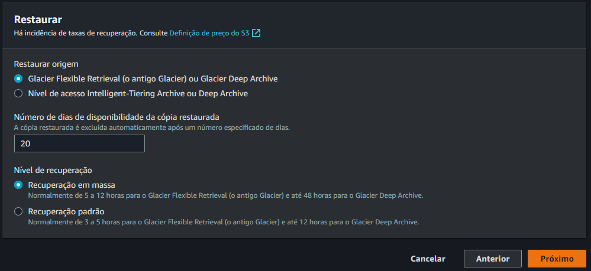

Fazer as configurações adicionais do job escolhendo `prioridade de execução`, `Bucket de destino do relatório de execução do job` e `IAM Role` a ser usada no processamento.

Nessa etapa, é precisa criar uma IAM Role que permita a execução do S3 Batch Operations. Fiz a criação da seguinte role adicionando a policy de `S3FullAccess`.

```json
{
    "Version": "2012-10-17",
    "Statement": [
        {
            "Effect": "Allow",
            "Principal": {
                "Service": "batchoperations.s3.amazonaws.com"
            },
            "Action": "sts:AssumeRole"
        }
    ]
}
```

Assim que o job estiver pronto, fazer a execução.

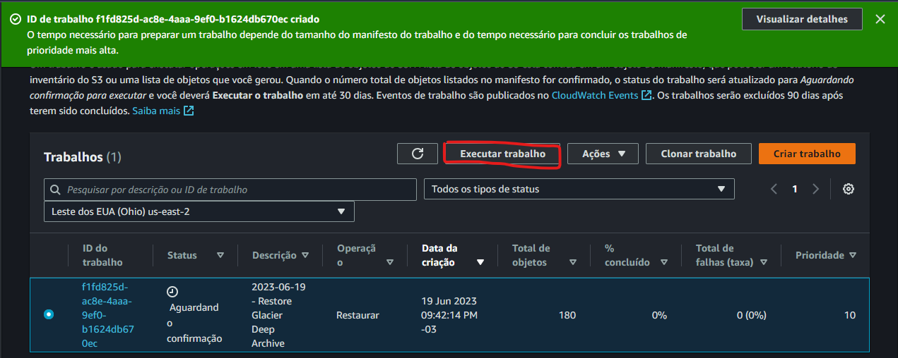

Aguardar a execução do job e checar se a operação teve sucesso. No meu caso, houve falha em 9% dos objetos.

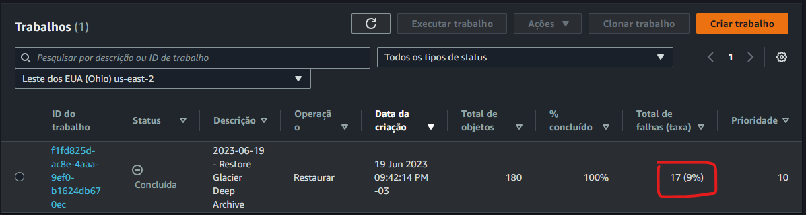

Para checar o que ocorreu, acessar o bucket de destino do report de execução.

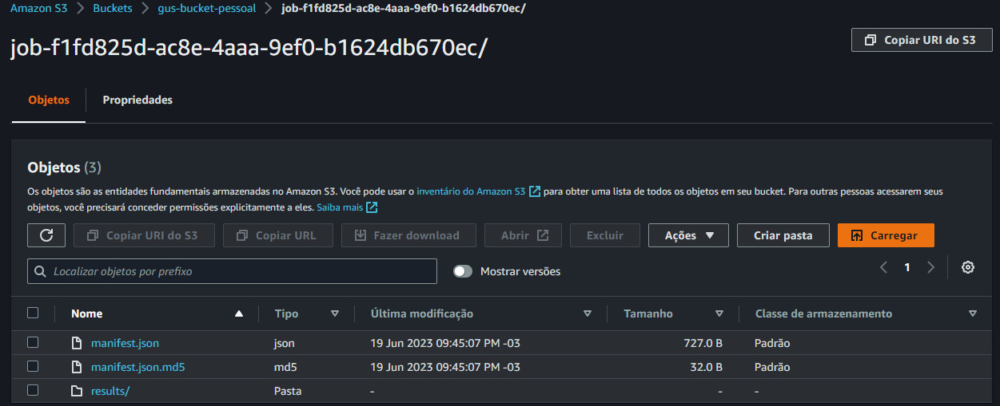

Dentro da pasta `/results`, vai existir um arquivo csv com os objetos cuja operação em lote teve sucesso e outro com os objetos que a operação falhou.

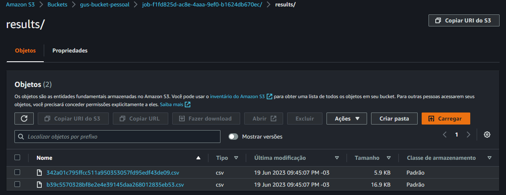

Lista dos 17 objetos em que houve falha no job do S3 Batch Operations.

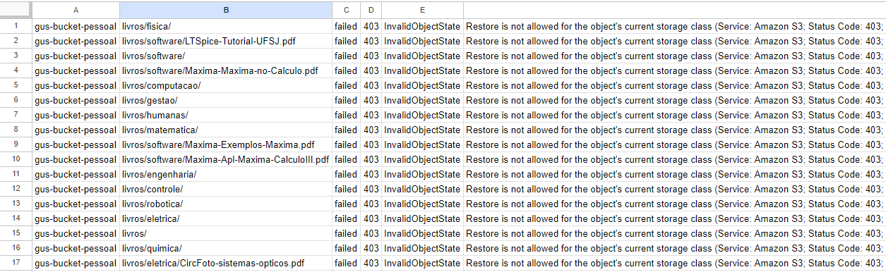

O motivo do erro, é que os 17 objetos não estavam armazenados no Glacier Deep Archive, sendo impossível de fazer o restor, como no caso do objeto `livros/eletrica/CircFoto-sistemas-opticos.pdf` que estava armazenado no Intelligent-Tiering.

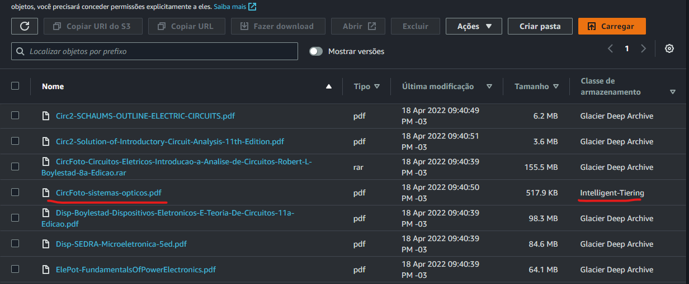

[](https://docs.aws.amazon.com/AmazonS3/latest/userguide/batch-ops.html)

### 3.5. Versionamento

O versionamento te permite manter diversas variantes de um objeto no mesmo bucket. Você pode usá-la para se proteger contra operações não intencionais do usuário e de falhas da aplicação, inclusive contra deleção ou substituição não intencional.

Ao excluir um objeto de um bucket com versionamento habilitado, o S3 irá inserir um **marcador de exclusão** em vez de remover o objeto permanentemente. O marcador de exclusão se torna a versão atual do objeto.

> Depois que um bucket é habilitado para versionamento, ele nunca pode voltar a um estado sem versionamento novamente, mas você pode **suspender o versionamento** nesse bucket.

O estado de versionamento se aplica a TODOS os objetos do bucket e não somente a alguns.

Se você já tiver objetos no bucket quando o versionamento for habilitado, os objetos existentes permanecerão com `OBJECT_ID` nulo, e só receberão um ID quando sofrerem alguma alteração.

[](https://docs.aws.amazon.com/pt_br/AmazonS3/latest/userguide/Versioning.html)

---

## 4. Gerenciamento de acesso e segurança

### 4.1. Bloqueio de acesso público

Por padrão, os buckets de S3 e seus objetos são privados. O bloqueio de acesso público do S3 fornece quatro configurações. É possível aplicar essas configurações em qualquer combinação a pontos de acesso individuais, buckets ou contas da AWS inteiras.

- Se você aplicar uma configuração a uma conta, ela se aplica a todos os buckets e pontos de acesso de propriedade dessa conta;
- Se você aplicar uma configuração a um bucket, ela se aplicará a todos os pontos de acesso associados a esse bucket.

> **Warning**
> - O Amazon S3 não oferece suporte a configurações de bloqueio de acesso público por objeto.

[](https://docs.aws.amazon.com/pt_br/AmazonS3/latest/userguide/access-control-block-public-access.html)

### 4.2. IAM

Com o IAM, é possível gerenciar, de maneira centralizada, permissões que controlam quais recursos da AWS os usuários poderão acessar.

[](https://docs.aws.amazon.com/pt_br/AmazonS3/latest/userguide/s3-access-control.html)

### 4.3. Bucket Policy

Políticas baseadas em recurso em JSON.

* Resources: buckets e objetos;
* Effect: Allow/ Deny
* Actions: Conjunto de APIs para habilitar ou negar;
* Principal: conta AWS ou usuário para aplicar a policy.

Bucket Policy é usada para:

* Habilitar acesso público ao bucket;
* Forçar objetos a serem criptografados no upload;
* Dar acesso a outra conta ao bucket (cross account).

Exemplo de bucket policy:

```json
{
    "Version": "2012-10-17",
    "Statement": [
        {
            "Sid": "PublicRead",
            "Effect": "Allow",
            "Principal": "*",
            "Action": [
                "s3:GetObject"
            ],
            "Resource": [
                "arn:aws:s3:::examplebucket/*"
            ]
        }
    ]
}
```


### 4.4. Endpoints/ Access Points

Simplificam a gestão de segurança para Buckets S3 removendo a complexidade de ter uma única bucket policy gigantesca.

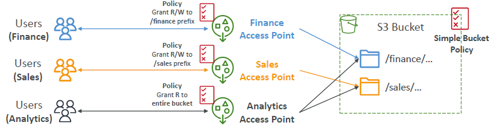

Cada ponto de acesso tem:

* Seu próprio DNS (Internet Origin ou VPC Origin);
* Uma Access Point Policy (similar a bucket policy) gerenciando a segurança em escala.

Podemos definir o access point para ser acessível apenas de dentro de uma VPC.
Devemos criar um VPC Endpoint para acessar o Access Point (Gateway ou Interface Endpoint).
O VPC Endpoint Policy precisa habilitar acesso ao Bucket Target e ao Access Point.

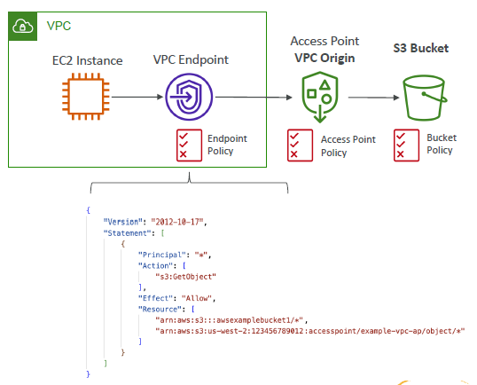

### 4.5. ACLs


### 4.6. Propriedade de objeto do S3


### 4.7. IAM Access Analyzer para S3

### 4.8. Criptografia

É possível criptografar os objetos no S3 usando 4 métodos:

* **Server-Side Encryption (SSE) with Amazon S3-Managed Keys (SSE-S3)**: habilitado por default;
* **SSE with KMS keys stored in AWS KMS (SSE-KMS)**: o KMS gerencia a chave de criptografia;
* **SSE with Customer-PRovided Keys (SSE-C)**: quando o cliente gerencia sua própria chave de criptografia;
* **Client-Side Encryption**. 

**SSE-S3**:

Criptografia usando chaves gerenciadas pela AWS. O objeto é criptografado no lado do servidor usando criptografia do tipo `AES-256`.

O header das requisições nesse caso precisam conter `"x-amz-server-side-encryption": "AES256"`.

Habilitado por default em novos buckets e novos objetos.

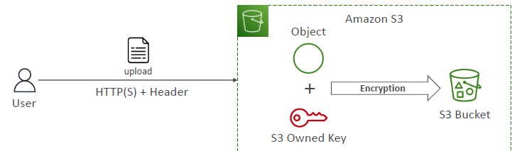

**SSE-KMS**:

Criptografia usando chaves gerencias pelo KMS.

Vantagens: controle do usuário + auditoria do uso da chave usando CloudTrail.

Limitações: se você usar SSE-KMS, será impactado pelos limites do KMS. Quando ocorrer upload no S3, será chamada a API `GenerateDataKey` do KMS e quando ocorrer download será chamada a API `Decrypt`. Essas chamadas de API estarão sujeitas a cota de requisições por segundo do KMS (5.500, 10.000, 30.000 req/s, dependendo da região).

> **Obs**.: é possível solicitar aumento de cotas usando o Service Quotas Console.

Objeto criptografado do lado do servidor e o header da requisição deve conter `x-amz-server-side-encryption": "aws:kms"`.

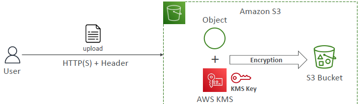

**SSE-C**:

Criptografia usando chave gerenciada pelo cliente fora da AWS.
O S3 não armazena a chave de criptografia que você fornece.

É obrigatório o uso de HTTPS.

A encryption key deve ser fornecida no header HTTP para cada requisição.

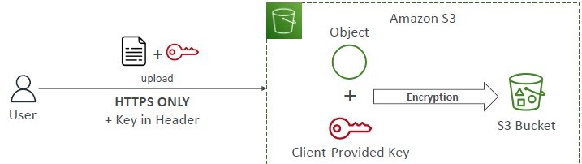

**Client-Side Encryption**:

Usa libraries como `Amazon S3 Client-Side Encryption Library` e o dado deve ser criptografado antes de ser enviado ao S3.

O cliente também precisa descriptografar o dado por si mesmo ao fazer download.

O cliente gerencia as chaves e todo o ciclo de criptografia.

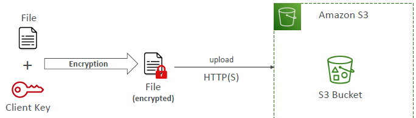

**Criptografia em trânsito (SSL/TLS)**

Criptografia de dados em trânsito é chamada de SSL/TLS,

Amazon S3 expõe 2 endpoints:

* HTTP Endpoint: não criptografado;
* HTTPS Endpoint: Criptografado.

É possível forçar criptografia em trânsito nas requisições:

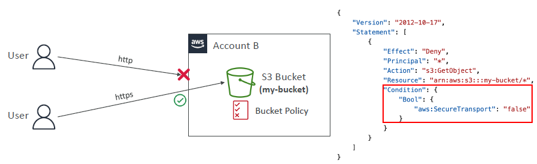

Também é possível configurar Bucket Policy para permitir `PUT` apenas de objetos criptografados.

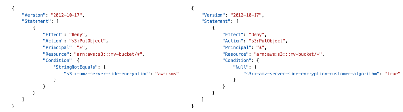

---

## 5. Outros recursos

### 5.1. S3 Storage Lens

Recurso de análise de armazenamento em nuvem para monitorar o uso e atividade do armazenamento de objetos no S3. Também fornece recomendações contextuais que você pode usar para otimizar custos de armazenamento e práticas recomendadas de proteção de dados.

O S3 Storage Lens fornece um painel padrão que é atualizado diariamente.

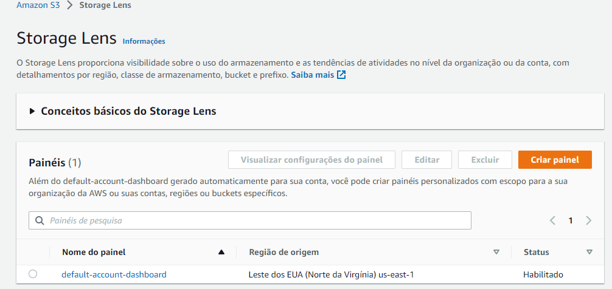

Ele oferece métricas gratuitas, bem como métricas e recomendações avançadas por custo adicional.

**Dash default**

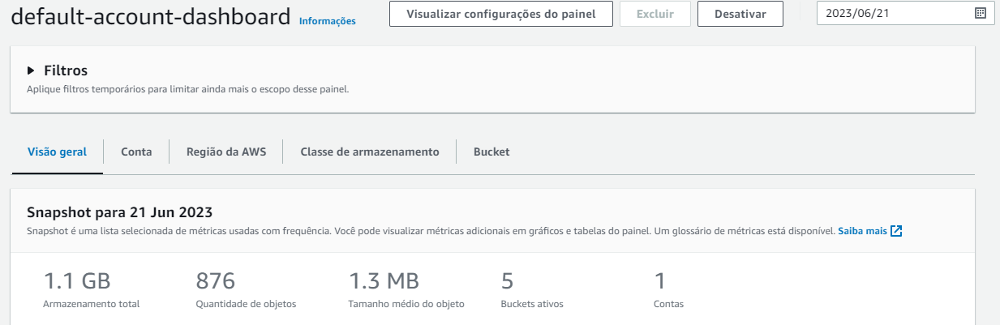
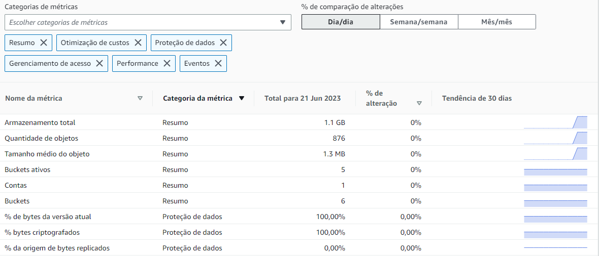
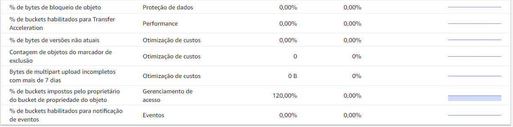
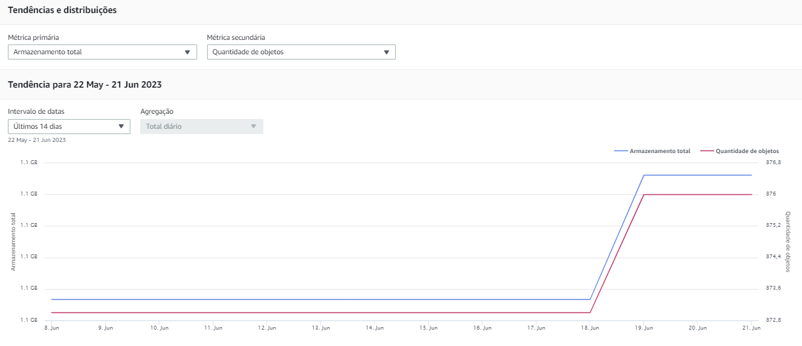

É possível criar painéis no nível organizacional habilitando o Storage Leans no AWS Organizations, para monitorar buckets de várias contas de forma centralizada.

> **Obs.**: ao criar um painel, os dados são exibidos no dash após 48h.

Também é possível exportar as métricas do Storage Lens em arquivos CSV ou Parquet em um bucket de destino para análise futura e analytics.

[](https://docs.aws.amazon.com/pt_br/AmazonS3/latest/userguide/storage_lens.html)

### 5.2. Análise de Classes de Armazenamento

Usando a análise de classe de armazenamento do Amazon S3, você pode analisar padrões de acesso de armazenamento para ajudar a decidir quando fazer a transição dos dados certos para a classe de armazenamento certa.

> **Warning**
> - A análise de classe de armazenamento fornece apenas recomendações para as classes IA Standart e Standart.

A Análise de Classe de Armazenamento é feita através da guia de Métricas do Bucket.

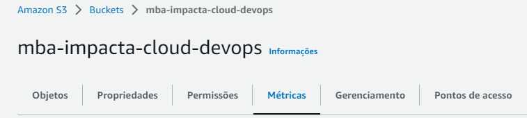
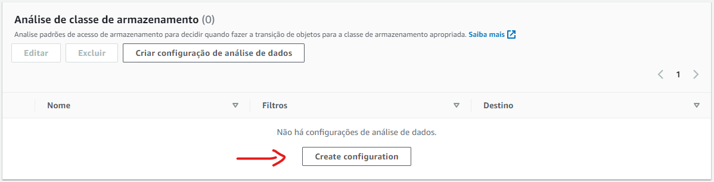

Você consegue definir o escopo da análise aplicando a todos os objetos do bucket ou filtrando por um prefixo (como o nome de uma pasta) ou por tags de objeto.

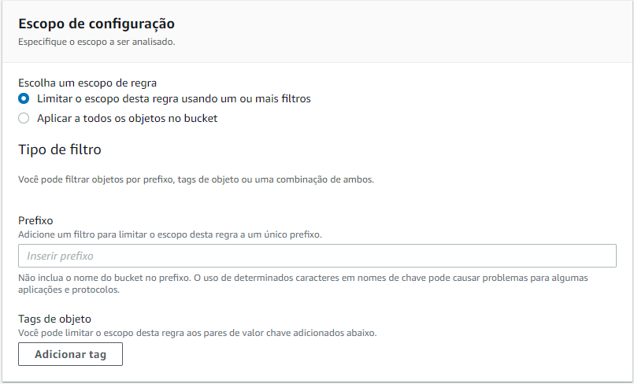

Você também pode escolher se quer exportar os resultados da análise para um CSV.

> **Note**
> - O relatório pode levar até 24h para você poder visualizar os dados.

[](https://docs.aws.amazon.com/pt_br/AmazonS3/latest/userguide/analytics-storage-class.html)

### 5.3. S3 Transfer Acceleration

Endpoint que acelera o ulpoad de dados para o S3, pois faz uso de um Edge Location. Você pode acessar o [SpeedTestTool](https://s3-accelerate-speedtest.s3-accelerate.amazonaws.com/en/accelerate-speed-comparsion.html) e verificar o desempenho de usar ou não o Transfer Acceleration.

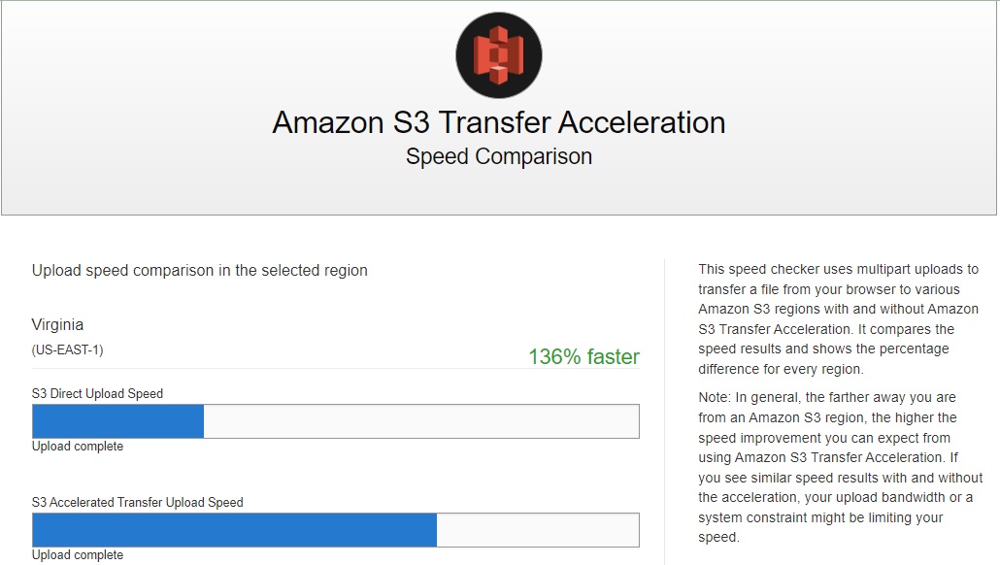

Você é cobrado por GB de dados movidos, mas se for identificado que o uso do Transfer Acceleration irá gerar um desempenho igual ou pior que um upload comum, esse recurso não é cobrado.

Por exemplo, se fizessemos upload para a região `sa-east-1`, o Transfer Acceleration não seria cobrado por apresentar uma performance pior que a de um upload comum.

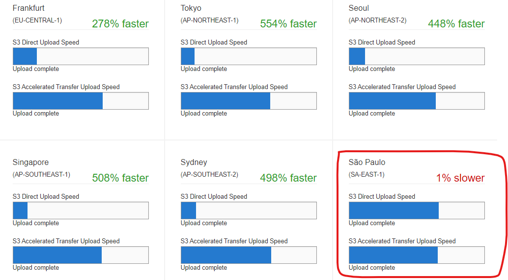

Para acessar o bucket que está habilitado para o Transfer Acceleration, você deve usar o endpoint `bucketName.s3-accelerate.amazonaws.com`

[](https://docs.aws.amazon.com/pt_br/AmazonS3/latest/userguide/transfer-acceleration.html)

### 5.4. Logs de Acesso

Fornece detalhes sobre as solicitações que são feitas a um bucket. Você pode usar logs de acesso ao servidor para muitos casos de uso, como conduzir auditorias de segurança e acesso, saber mais sobre sua base de clientes e entender sua fatura do Amazon S3.

Você habilita os logs de acesso no menu de `Propriedades` do bucket. É preciso informar um bucket de destino para armazenar os logs e é recomendado que você **não use o mesmo bucket que monitorará os acessos como bucket de destino dos logs**.

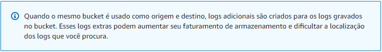

[](https://docs.aws.amazon.com/pt_br/AmazonS3/latest/userguide/ServerLogs.html)

### 5.5. S3 Select

Linguagem de consulta estruturada (SQL) para filtrar o conteúdo de um objeto no S3 e recuperar somente o subconjunto de dados necessários. Funciona em objetos armazenados em formato CSV, JSON ou Apache Parquet. Também funciona com objetos compactados com GZIP ou BZIP2 (somente para CSV ou JSON) e objetos criptografados no lado do servidor.

O console limita a quantidade de dados retornados em 40 MB. Para recuperar mais dados use CLI ou API.

Não é possível rodar a query em objetos do Glacier e o formato de saída é CSV ou JSON.

Ao acessar um objeto, é possível consultá-lo acessando **Ações de objeto** e clicando em **Consulta com o S3 Select**.

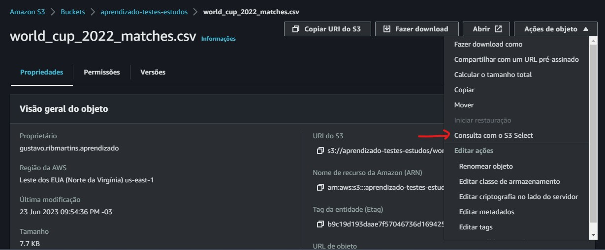

Informe as configurações do arquivo de entrada, que é o arquivo que será analisado.

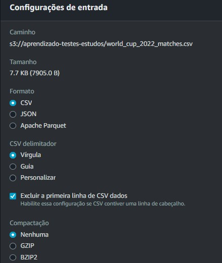

Configure a saída e a consulta SQL que deseja executar.

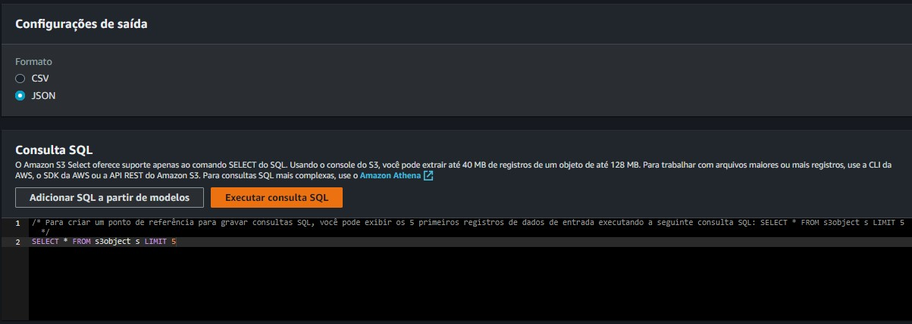

Ao clicar em `Executar consulta SQL` os dados são exibidos.

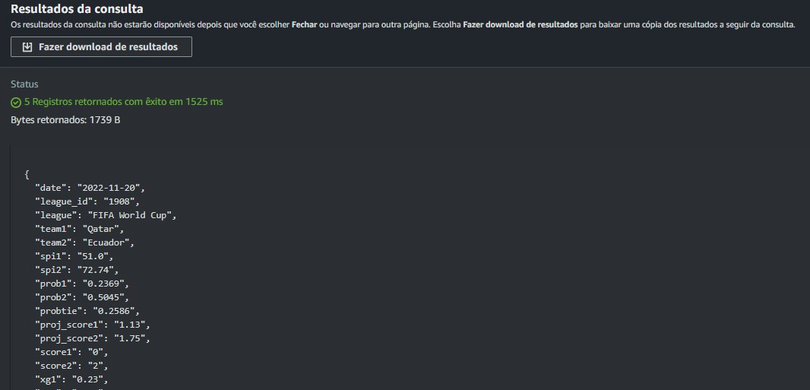

[](https://docs.aws.amazon.com/pt_br/AmazonS3/latest/userguide/selecting-content-from-objects.html)

### 5.6. Hospedagem de Sites Estáticos

Você pode usar o Amazon S3 para hospedar um site estático. Em um site estático, as páginas da Web individuais incluem conteúdo estático. Elas também podem conter scripts do lado do cliente.

Ao contrário, um site dinâmico depende do processamento no servidor, incluindo scripts executados no servidor, como PHP, JSP ou ASP.NET. O Amazon S3 não oferece suporte a scripts no lado do servidor, mas a AWS tem outros recursos para hospedar sites dinâmicos.

Para habilitar hospedagem de site estático, é preciso editar as `Propriedades` do Bucket.

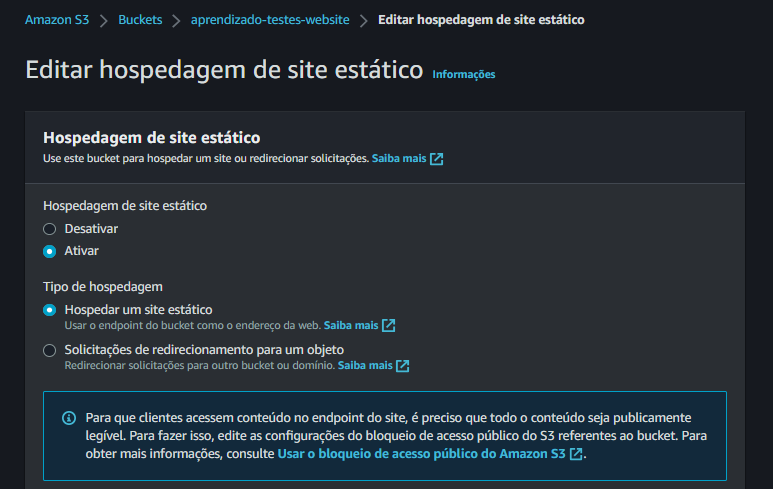

Informar o nome do arquivo que fará papel de `index.html`, que será retornado quando o S3 receber solicitações para o domínio raiz ou alguma subpasta.

Por exemplo, se um usuário insere `http://www.example.com` no navegador, ele não está solicitando nenhuma página específica. Nesse caso, o S3 exibe o index.html, que é a página padrão.

Informar o nome do arquivo de erros personalizado para erros da classe 4XX. Se você não informar, ao ocorrer um erro, o S3 retornará um documento de erro HTML padrão.

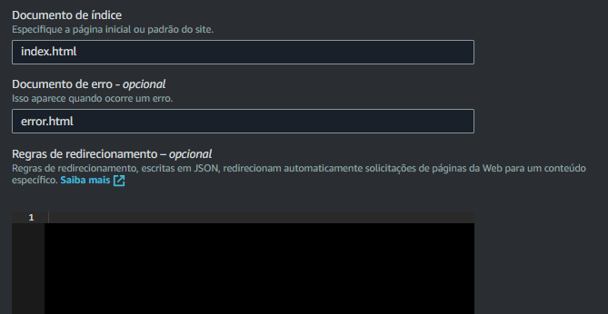

Opcionalmente, você pode configurar regras avançadas de redirecionamento, por exemplo, encaminhar condicionalmente de acordo com nomes de chave de objeto ou prefixos especificados na solicitação.

Ao salvar, será criado um endpoint para o site estático no seguinte padrão:

```
http://<nome do bucket>.s3-website-<região>.amazonaws.com
```

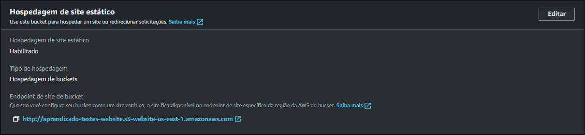

Para o website se tornar acessível, é preciso editar as configurações de **bloqueio de acesso público** e remover o bloqueio default.

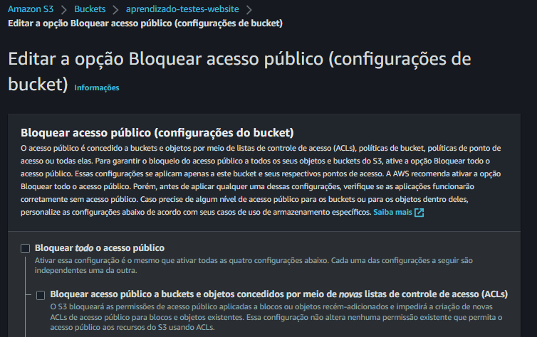

Depois de remover o bloqueio de acesso público, é preciso criar uma `Bucket Policy` para conceder acesso público de leitura.

Exemplo de Policy:

```json
{
    "Version": "2012-10-17",
    "Statement": [
        {
            "Sid": "PublicReadGetObject",
            "Effect": "Allow",
            "Principal": "*",
            "Action": [
                "s3:GetObject"
            ],
            "Resource": [
                "arn:aws:s3:::Bucket-Name/*"
            ]
        }
    ]
}
```

Depois de configurar os acessos, você precisa fazer upload do arquivi `index.html` com o conteúdo da página (e do `error.html` caso não vá usar o default da AWS).

Exemplo de `index.html`:

```html
<html xmlns="http://www.w3.org/1999/xhtml" >
<head>
    <title>Bem-vindo!</title>
</head>
<body>
  <h1>Bem-vindo ao site!</h1>
  <p>Agora hospedado no Amazon S3!</p>
  
</body>
</html>
```

O código acima gera a seguinte página:


Faça o mesmo para o arquivo `error.html`, e em casos de erro a requisição será direcionada pra ele. Por exemplo, se eu passar a url `http://aprendizado-testes-website.s3-website-us-east-1.amazonaws.com/nao-existe` no navegar, para uma página que não existe no meu site, o arquivo `error.html` será retornado.


> **Note**
> - O S3 não oferece suporte para acesso HTTPS ao site, somente HTTP. Se quiser usar HTTPS, é preciso usar o Amazon CloudFront para servir um site estático hospedado no S3.

[](https://docs.aws.amazon.com/pt_br/AmazonS3/latest/userguide/HostingWebsiteOnS3Setup.html)

### 5.7. Multpart Upload

Permite que você faça upload de um único objeto como um conjunto de partes. Cada parte é uma parte contínua de dados do objeto e o upload dessas partes pode ser feito de forma independente e em qualquer ordem. Se a transmissão de umas das partes falhas, vocÊ pode retransmitir essa parte sem afetar as outras. Depois que todas as partes do objeto forem carregadas, o S3 montará essas partes e criará o objeto.

Esse tipo de upload é recomendado quando você precisa fazer upload de objetos maiores que 100 MB (e extremamente recomendado para objetos maiores que 5 GB).

Benefícios do Multipart Upload:

1. **Throughput aprimorado**: a carga das partes pode ser feita em paralelo;

2. **Recuperação rápida de falhas de rede**: se houver falhas de rede, basta reiniciar o carregamento que falhou;

3. **Pausar e retomar carregamentos**: você pode carregar as partes do objeto ao longo do tempo. Após ser iniciado um carregamento fracionado, ele não expira; você deve concluir ou interromper explicitamente o multipart upload;

4. **Começar um carregamento antes de saber o tamanho final do objeto**: carregar o objeto a medida que ele é criado.

[](https://docs.aws.amazon.com/pt_br/AmazonS3/latest/userguide/mpuoverview.html)

### 5.8. Cross Resource Sharing

Compartilhamento de recursos de origem cruzada (CORS) define uma maneira de aplicativos web client carregados em um domínio interagirem com recursos em outro domínio.

#### Cenários de uso

**Cenário 1:**

Você hospeda um site estático no S3 chamado `website` que é acessível através do endpoint `http://website.s3-website.us-east-1.amazonaws.com`.

Agora, você quer fazer uso de JavaScript nas páginas desse bucket para fazer solicitações GET e PUT autenticadas no mesmo bucket usando o endpoint da API do S3 para o bucket: `website.s3.us-east-1.amazonaws.com`.

Um navegador normalmente impediria que o JavaScript fizesses essas solicitações, mas com CORs, é possível configurar o bucket para permitir explicitamente solicitações de origem cruzada de `website.s3-website.us-east-1.amazonaws.com.`.

**Cenário 2:**

Você possui um website estático no S3 e precisa acessar dados de outro domínio, como outro site em um outro bucket S3.

[](https://docs.aws.amazon.com/pt_br/AmazonS3/latest/userguide/cors.html)

### 5.9. Amazon S3 Analytics

Te ajuda a decidir quanto mover um objeto para a classe de armazenamento apropriada.

Faz recomendações para classes Standart e Standart IA (não faz para One-Zone IA ou Glacier).

O report é atualizado diariamente e leva de 24 a 48h para começar a ver a analise de dados.

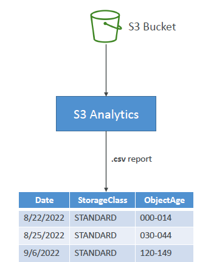

### 5.10. Notificação de eventos

É possível disparar eventos com base em ações que ocorrem no S3:

* S3:ObjectCreated;
* S3:ObjectRemoved;
* S3:ObjectRestored;
* S3:Replication.

Geralmente, o S3 entrega eventos em alguns segundos, mas pode levar até alguns minutos.

**Ferramentas que consomem os eventos do S3**:
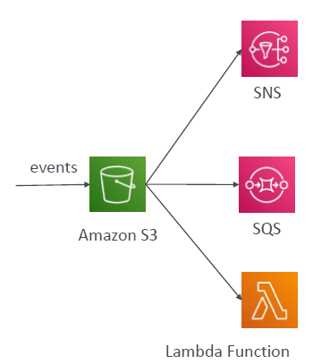

* Para SNS: configurar a SNS Resource Policy para que os eventos do S3 disparem tópicos do SNS;

```json
{
    "Version": "2012-10-17",
    "Statement": {
        "Effect": "Allow",
        "Action": "SNS:Publish",
        "Principal": {
            "Service": "s3.amazonaws.com"
        },
        "Resource": "arn:aws:sns-us-east-1:123456789012:MyTopic",
        "Condition":{
            "ArnLike":{
                "aws:SourceArn": "arn:aws:s3:::MyBucket"
            }
        }
    }
}
```

* Para SQS: configurar a SQS Resource Policy para que o queue recebe eventos do S3;

```json
{
    "Version": "2012-10-17",
    "Statement": {
        "Effect": "Allow",
        "Action": "SQS:SendMessage",
        "Principal": {
            "Service": "s3.amazonaws.com"
        },
        "Resource": "arn:aws:sqs-us-east-1:123456789012:MyQueue",
        "Condition":{
            "ArnLike":{
                "aws:SourceArn": "arn:aws:s3:::MyBucket"
            }
        }
    }
}
```

* Para lambda: configurar a Lambda Resource Policy para consumir os eventos do S3 no Lambda.

```json
{
    "Version": "2012-10-17",
    "Statement": {
        "Effect": "Allow",
        "Action": "lambda:InvokeFunction",
        "Principal": {
            "Service": "s3.amazonaws.com"
        },
        "Resource": "arn:aws:lambda-us-east-1:123456789012:function:MyFunction",
        "Condition":{
            "ArnLike":{
                "aws:SourceArn": "arn:aws:s3:::MyBucket"
            }
        }
    }
}
```

Também é possível consumir os eventos do S3 no Amazon Event Bridge.

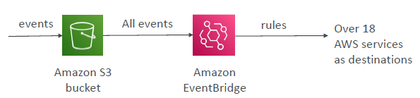

* Advanced Filtering: opções com JSON rules (metadata, object size, name...);
* Multiple Destinations: ex. Step Functions, Kinesis Streams;
* EventBridge Capabilities: Archive, Replay Events.

### 5.11. S3 Byte-Range Fetches

Paraleliza GETs ao requisitar um range específico de bytes do objeto. Dá uma boa resiliência em caso de falhas e pode ser usado para aumentar a velocidade de download de um objeto ou para recuperar apenas um pedaço do objeto de interesse.

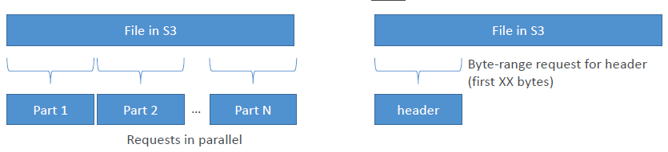

### 5.12. S3 Object Lambda

---

## 6. Modelo de consistência de Dados

O S3 oferece uma forte consistÊncia de leitura após gravação para solicitações de PUT e DELETE de objetos no bucket em todas as regiões da AWS. Isso se aplica as gravações em novos objetos, solicitações de PUT que sobrescrevem objetos existentes e solicitações de DELETE.

As atualizações em um único key são atômicas. Por exemplo, se você executar um PUT em um objcet-key e um GET no mesmo object-key simultaneamente, você obterá os dados antigos ou novos, mas nunca dados parciais ou corrompidos.

O Amazon S3 atinge alta disponibilidade replicando dados entre vários servidores nos datacenters da AWS. Se uma solicitação PUT for bem-sucedida, os dados serão armazenados com segurança. Qualquer leitura (solicitação de GET ou LIST) iniciada após o recebimento de uma resposta PUT bem-sucedida retornará os dados escritos pelo PUT.

> **Note**
>
> - O Amazon S3 não oferece suporte ao bloqueio de objetos para escrita simultânea. Se duas solicitações PUT forem realizadas simultaneamenta na mesma chave, a solicitação com timestamp mais recente será a escolhida. Se isso for um problema, você precisará criar um mecanismo de bloqueio de objetos em sua aplicação.
>
> - As atualizações são baseadas em chave, não é possível realizar atualizações atômicas entre chaves. Por exemplo, você não pode tornar a atualização de uma chave dependente da atualização de outra chave, a menos que vocÊ desenvolva essa funcionalidade na aplicação.

As configurações de bucket têm um modelo de consistência eventual, dessa forma:

- Se você excluir um bucket e listar imediatamente todos os buckets, o bucket excluído ainda poderá ser exibido na lista;
- Se você ativar o versionamento em um bucket pela primeira vez, pode levar um curto período de tempo para que a alteração seja totalmente propagada. A recomendação da AWS é aguardar 15 minutos após ativar o vesionamento antes de realizar gravações (PUT ou DELETE).

#### Exemplos de aplicações simultâneas e comportamento esperado

Exemplos de comportamento esperado do S3 em casos de operações feitas no mesmo objeto.

**i) Escritas sequenciais**

O cliente 1 finaliza o PUT do objeto em T1 e o cliente 2 inicia o PUT do objeto em T2, após a primeira escrita ter finalizado, e finaliza em T3.

Nesse caso, qualquer GET feito após T3 retornará o objeto escrito pelo cliente 2.

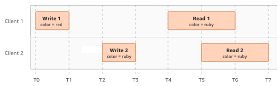

**ii) Leitura e escrita simultânea**

Nesse caso, ocorre o seguinte:

- O cliente C2 inicia uma escrita W2 em T2 que termina em T4;
- Porém, em T3 o cliente C1 inicia uma leitura R1, antes da escrita W2 finalizar.

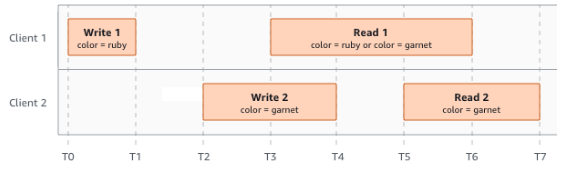

Nesse caso, como o S3 ainda não recebeu a confirmação da escrita W2, a leitura R1 pode retornar a versão antiga ou nova do objeto sobrescrito por W2.

**iii) Escritas simultâneas**

Aqui, o cliente C1 realiza uma escrita W1 que inicia em T0 e termina em T2, porém antes de finalizar, o cliente C2 inicia uma escrita W2 em T1.

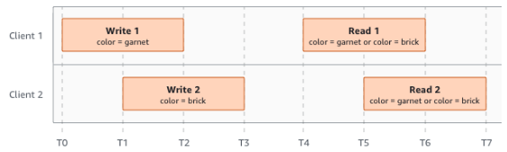

Nesse caso, o S3 usará a regra do **último escritor** para determinar qual gravação tem precedência. No entanto, a ordem em que o Amazon S3 recebe as solicitações e a ordem em que as aplicações recebem confirmações não podem ser previstas devido a fatores como a latência de rede. Por exemplo, o W2 pode ser iniciado por uma instância do Amazon EC2 na mesma região, enquanto o W1 pode ser iniciado por um host que está mais longe. A melhor maneira de determinar o valor final é realizar uma leitura após ambas as gravações terem sido confirmadas.

[](https://docs.aws.amazon.com/pt_br/AmazonS3/latest/userguide/Welcome.html)